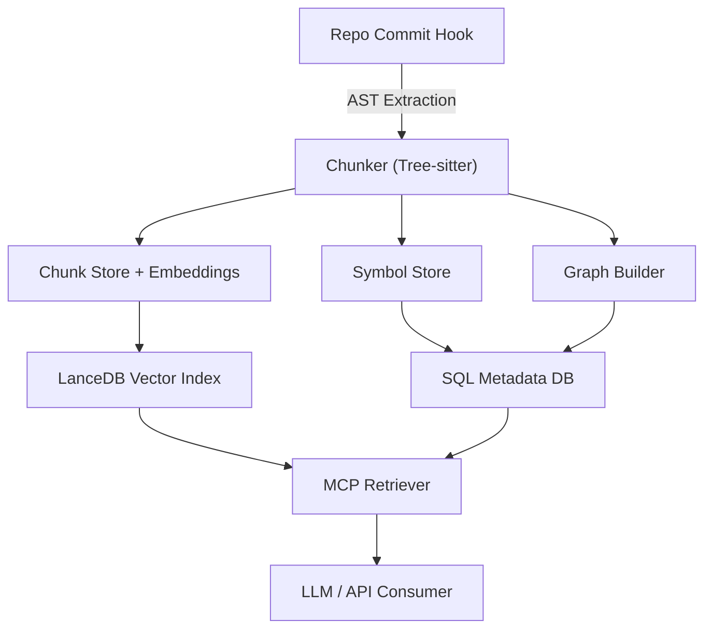
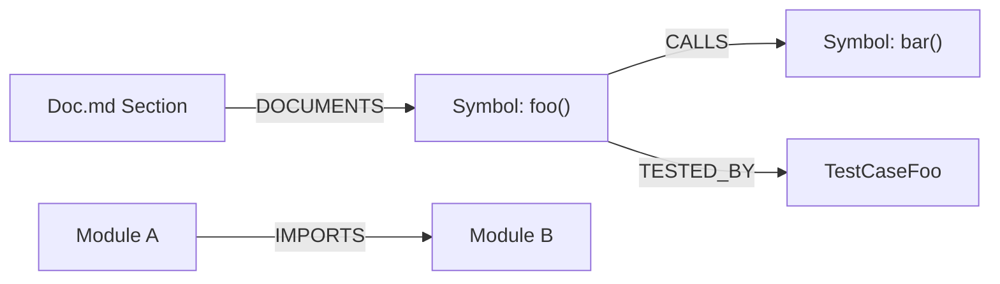
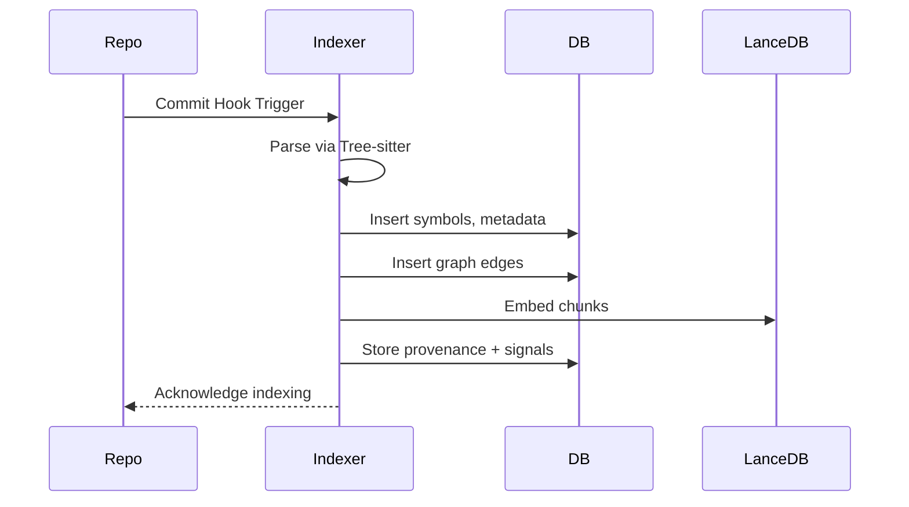
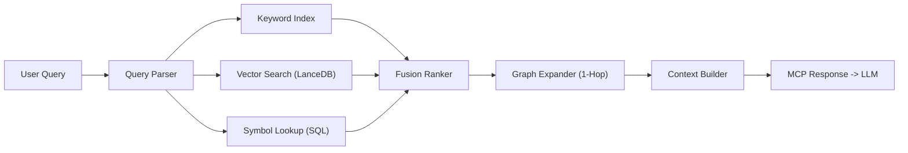

# MCP Code Intelligence Indexing Architecture

**Version:** 0.4
**Status:** Detailed Specification  
**Author:** Taylor Cathcart  
**Date:** 2025-10-29

---

## Overview

This document specifies the **MCP Code Intelligence Indexing System** — a framework for semantic retrieval and LLM-aided reasoning over large codebases. The system decomposes repositories into AST-bounded code chunks, embeds them in a vector space, connects them via a graph, and returns structured metadata for contextually aware inference.

The goal: to provide an **LLM-native retrieval substrate** that unites structural precision (from Tree-sitter) with semantic generalization (from embeddings), enabling natural-language reasoning over source code, tests, and documentation.

---

## Objectives

1. **Semantic precision**: Retrieve relevant code for natural-language queries.  
2. **Symbolic structure**: Preserve identifiers, scopes, and file-level anchors.  
3. **Graph context**: Model calls, dependencies, and test relationships.  
4. **Scalability**: Support asynchronous indexing triggered by post-commit hooks.  
5. **Hybrid performance**: Blend SQL for metadata and LanceDB for vectors.  
6. **Extensibility**: Add polyglot language support progressively.

---

## Architecture

### Components Overview




---

## Data Model

### 1. Symbol Store (SQL)

Holds all named entities for exact resolution and metadata enrichment.

| Field | Type | Description |
|-------|------|-------------|
| `symbol_id` | TEXT PK | Global unique identifier (e.g., `py://pkg.mod.Class.method`) |
| `name` | TEXT | Symbol name |
| `kind` | TEXT | Function, Class, Method, Type, Const |
| `language` | TEXT | python, typescript, markdown |
| `file_path` | TEXT | File in repo |
| `start_byte` | INT | Start offset |
| `end_byte` | INT | End offset |
| `signature` | TEXT | Function or class signature |
| `docstring` | TEXT | Extracted docstring |
| `exported` | BOOL | Whether public/exported |
| `repo_id` | TEXT | Repository name |
| `commit` | TEXT | Commit SHA |
| `hash_anchor` | TEXT | Stable content hash |

**Indexing logic:** Each Tree-sitter node representing a top-level declaration is transformed into a symbol record with a deterministic ID. Relationships to parent and child nodes are recorded as graph edges.

---

### 2. Chunk Store (SQL + LanceDB)

Chunks represent atomic retrieval units. Each corresponds roughly to a function, class, or Markdown section.

| Field | Type | Description |
|-------|------|-------------|
| `chunk_id` | TEXT PK | Content hash |
| `file_path` | TEXT | Path in repo |
| `language` | TEXT | Language |
| `symbol_ids` | ARRAY | Linked symbols |
| `content` | TEXT | Raw text |
| `prefix_context` | TEXT | Few lines before |
| `suffix_context` | TEXT | Few lines after |
| `embedding` | VECTOR | Semantic vector (single vector) |
| `embedding_model` | TEXT | e.g., `text-embedding-3-small` |
| `embedding_version` | INT | Model/version counter |
| `token_count` | INT | Token length |
| `chunk_sequence` | INT | Position within multi-chunk sequence (nullable) |
| `total_chunks` | INT | Total chunks in sequence (nullable) |
| `repo_id` | TEXT | Repository ID |
| `commit` | TEXT | Commit hash |

**Chunking strategy:**
- For Python/TS: functions and classes are chunk boundaries.  
- For Markdown: headings define chunk boundaries.  
- Long functions/classes are multi-chunked using token-based slicing with overlap; `chunk_sequence`/`total_chunks` track order.  
- Prefix/suffix adds overlapping context for coherence.  
- Each chunk generates a single embedding created from a labeled concatenation of code + docstring + signature (late fusion at input time).

---

### 3. Graph Overlay



Each edge type enables 1-hop context expansion.

| Type | Description |
|------|--------------|
| CALLS | Function calls another function |
| IMPORTS | Module or file import |
| IMPLEMENTS / OVERRIDES | Class inheritance |
| TESTS / TESTED_BY | Link tests to code |
| DOCUMENTS | Markdown/ADR links |
| COCHANGED_WITH | Derived from git history |

Each node caches small summaries for fast inclusion in LLM prompts.

#### Edge Confidence and Calibration
- Each graph edge stores a `confidence` score (0–1) reflecting inference reliability (e.g., CALLS via static analysis vs. IMPORTS via explicit statements).
- Initial defaults are set by small-sample evaluation; we periodically calibrate by:
  - Sampling N edges per type and language, manually/heuristically verifying targets exist and match.
  - Estimating empirical precision per edge type to set confidence priors and retrieval thresholds.
  - Optionally boosting confidences for TESTS/TESTED_BY when corroborated by coverage traces.
- Retrieval uses a confidence threshold (e.g., ≥0.85) to filter low-reliability neighbors; thresholds are tunable per use case.

---

### 4. Provenance / Signals

Captures quality, ownership, and freshness.

| Field | Type | Description |
|-------|------|-------------|
| `repo_id` | TEXT | Repository |
| `commit_hash` | TEXT | Commit |
| `author` | TEXT | Last modifier |
| `coverage` | REAL | Test coverage |
| `churn_30d` | INT | Edits in last month |
| `owners` | TEXT[] | Code owners |
| `last_modified` | TIMESTAMP | Recent change |
| `embedding_version` | TEXT | Model used |
| `embedding_dim` | INT | Dimensionality |
| `visibility` | TEXT | internal/public |

---

## Indexing Workflow



**Process:**  
1. Commit hook triggers asynchronous job.  
2. Chunker extracts symbols and chunks.  
3. Embeddings computed and stored in LanceDB.  
4. Metadata written to SQL (SQLite or Postgres).  
5. Graph relationships inserted.  
6. Provenance updated.

### Incremental Indexing Spec (Diff-Based)
- Detect changed files via `git diff old..new` and process only those files.
- For changed files: soft-delete prior `symbols`/`chunks` at `old_commit` (retain history via `active=false`), remove edges referencing them.
- Parse and re-index changed files at `new_commit`; embed only new/changed chunks.
- Insert updated symbols, chunks, and edges; set `embedding_model`/`embedding_version` per chunk.
- Maintain an `index_jobs` log for progress/resume on failure (lists of changed, processed, failed files). On restart, continue from remaining files.

### Indexing Orchestration & Backpressure
- Single-worker queue for now: enqueue commits, process serially; latest head will eventually be indexed.
- If commits arrive faster than indexing completes, the queue grows; we surface queue depth as an operational metric and process in order.
- Next phase: parallelize by file with a worker pool; ensure DB writes are batched and guarded to avoid contention.

---

## Retrieval Flow



---

### Graph Expansion and Deduplication Policy
- Graph expansion: 1-hop neighbors only, filtered by `confidence ≥ 0.85`, cap neighbors per node (e.g., ≤ 10) to avoid explosion.
- Scoring: neighbor scores are down-weighted (e.g., ×0.6) relative to primary hits.
- Deduplication:
  - Location-based: drop overlapping results from same file/span (O(K) on K candidates).
  - Semantic: drop near-duplicates by embedding similarity among top-K (naive O(K^2); acceptable for small K≤50; can switch to LSH later for O(K log K)).
- Context budget: cap aggregated context tokens (e.g., ≤2k tokens), prioritize primary hits, then highest-confidence neighbors.

## MCP Response Schema

The MCP tool returns rich JSON objects with provenance and graph context:

```json
{
  "type": "code_chunk",
  "rank": 1,
  "score": 0.83,
  "chunk_id": "blake3:abc123",
  "symbol": {"symbol_id": "py://pkg.mod.fn", "kind": "function"},
  "location": {"repo_id": "repo", "commit": "abc1234", "file_path": "src/mod.py"},
  "content": "def foo(): ...",
  "graph": {"calls": ["bar"], "docs": ["docs/usage.md"]},
  "signals": {"coverage": 0.7, "last_modified": "2025-10-12"},
  "provenance": {"embedding_version": "e5-large-v3"}
}
```

---

## Implementation Plan

### Phase 1 — Core Indexing (Python, TS, Markdown)

- [x] Implement Tree-sitter parsers and AST walkers.  
- [x] Build `symbols`, `chunks`, and `graph_edges` tables.  
- [x] Integrate LanceDB for vector storage.  
- [ ] Add CLI for post-commit indexing (`mcp-index`).  
- [ ] Expose simple search endpoint via MCP API.

### Phase 2 — Graph Expansion + Hybrid Retrieval

- [ ] Implement graph enrichment (CALLS, IMPORTS, TESTS) with edge confidences + thresholds.  
- [ ] Add BM25 index for keyword recall.  
- [ ] Implement reciprocal rank fusion.  
- [ ] Bundle top N results with 1-hop neighbors.
- [ ] Optional: Support `e5-large-v3` embeddings and add migration scaffold (dual-index during eval).  
- [ ] Parallelize file processing with a worker pool and commit queue backpressure.

### Phase 3 — Provenance + Ranking Signals

- [ ] Integrate git blame for `author` and `churn_30d`.  
- [ ] Add coverage ingestion (pytest or nyc).  
- [ ] Store owner and license info.  
- [ ] Tune scoring weights for freshness and quality.

### Phase 4 — Polyglot + Context Optimization

- [ ] Add support for Go, Rust, C#.  
- [ ] Optimize chunker for large files (token-based slicing).  
- [ ] Precompute “neighborhood summaries”.  
- [ ] Integrate near-duplicate suppression (minhash).

---

## Evaluation Metrics

- Index freshness: ≤ 2 min post-commit (p95)
- Indexing success rate: ≥ 99%
- Symbol coverage: ≥ 98% of parsable symbols indexed
- Retrieval quality (manual eval set): Precision@5 ≥ 0.75, Recall@10 ≥ 0.70, MRR ≥ 0.70
- Query latency: p50/p95 ≤ 300 ms (10k chunks)
- Embedding throughput: track chunks/min for scaling decisions

## Performance Targets

| Metric | Goal |
|--------|------|
| Retrieval latency | < 300 ms (10k chunks) |
| Embedding throughput | 10k chunks/min with batching |
| Index refresh | ≤ 2 min post-commit |
| Query response | ≤ 100 ms SQL + ≤ 150 ms vector |

---

## Future Enhancements

- Query rewriting using LLM to improve recall.  
- Semantic deduplication of context.  
- Caching frequent query graphs.  
- Schema migrations for new embedding models.  
- Cross-repo dependency mapping.

---

## Open Questions / Future Work Checklist

- Ranking fusion details: exact weighting/normalization for BM25 vs. vector vs. symbol hits
- Learned reranker: whether/when to add a lightweight cross-encoder for top-K re-ranking
- Edge confidence calibration cadence and automation (CI job vs. on-demand)
- TESTS/TESTED_BY improvements via coverage traces or naming heuristics tuning
- Parallelization architecture: process pool vs. thread pool, DB batching strategy, and write contention control
- LSH/minhash for large-K semantic dedupe to reduce O(K^2) cost
- Workspace boundaries in monorepos and cross-repo search semantics
- Access control/visibility enforcement at query time (beyond the `visibility` field)
- Embedding model evaluation harness and dual-index migration playbook
- Caching layer for frequent queries and neighborhood expansions
- Error budgets and alerts for freshness, latency, and retrieval precision regressions

---

## Summary

This specification defines a scalable, hybrid semantic indexing architecture for LLM-assisted code understanding. It unifies syntax, semantics, and provenance in a single retrieval substrate, optimized for both recall and interpretability.

The next step is implementation of **Phase 1 Core Indexing** followed by early retrieval experiments on real-world repositories.

---

## Appendix: Pseudocode for Implementers

### A1. Diff-Based Incremental Indexing with Resume

```python
# Pseudocode (Python-like)

def incremental_index(repo, old_commit, new_commit):
    """Process only changed files, preserve history, and resume on failure."""
    # Determine changed files
    changed = git_diff(repo, old_commit, new_commit)  # returns list[str]

    # Mark previous entities for these files as inactive and remove edges
    for path in changed:
        deactivate_symbols_and_chunks(path, old_commit)   # sets active=false
        delete_edges_for_file(path, old_commit)           # remove edges touching those symbols

    # Process files with checkpointing
    job = ensure_job(old_commit, new_commit, changed)

    for path in job.remaining_files():
        try:
            src = read_file_at_commit(repo, path, new_commit)
            lang = language_for(path)
            ast = parse_with_treesitter(src, lang)

            symbols = extract_symbols(ast, path, new_commit)
            chunks = extract_chunks(ast, path, new_commit)  # includes chunk_sequence/total_chunks

            # Build embedding inputs via labeled concatenation
            docs = [labeled_concat(c.code, c.docstring, c.signature) for c in chunks]
            embs = embed_batch(docs, model='text-embedding-3-small')

            insert_symbols(symbols)
            insert_chunks(chunks, embs, model='text-embedding-3-small', version=1)
            infer_and_insert_edges(symbols, path, new_commit)  # includes confidence

            job.mark_processed(path)
        except Exception as e:
            job.mark_failed(path, str(e))
            continue  # proceed to next file

    job.finish()
```

### A2. Edge Confidence Calibration Loop

```python
# Calibrate edge confidences per (edge_type, language) using sampled verification

def calibrate_edge_confidence(edge_type, language, sample_size=200):
    edges = sample_edges(edge_type=edge_type, language=language, n=sample_size)
    positives = 0

    for e in edges:
        # Heuristic/ground truth check (cheap): target symbol exists and matches expected module/name
        if symbol_exists(e.target_symbol_id) and validate_edge_semantics(e):
            positives += 1

    precision = positives / max(1, sample_size)
    set_confidence_prior(edge_type, language, precision)  # store as default confidence
    return precision
```

### A3. One-Hop Expansion with Deduplication and Budgeting

```python
# Inputs: ranked primary results with scores + embeddings
# Output: final list within token budget

def expand_and_build_context(primary, max_neighbors=10, conf_thresh=0.85, token_budget=2000):
    results = []

    # Step 1: Add primaries first
    for p in primary:
        if within_budget(results, p, token_budget):
            p.role = 'primary'
            results.append(p)

        # Step 2: Add 1-hop neighbors (down-weighted)
        neighbors = get_neighbors(p.symbol_id, min_conf=conf_thresh, limit=max_neighbors)
        for n in neighbors:
            n.score *= 0.6
            n.role = 'neighbor'
            if within_budget(results, n, token_budget):
                results.append(n)

    # Step 3: Deduplicate (location first, then semantic)
    results = dedupe_by_location(results)
    results = dedupe_by_semantics(results, max_k=50, similarity_thresh=0.95)

    return results
```

### A4. Deduplication Routines

```python
# O(K) location-based dedupe

def dedupe_by_location(items):
    seen = set()
    out = []
    for it in items:
        key = (it.file_path, it.start_byte // 16)  # coarse span bucket
        if key in seen:
            continue
        seen.add(key)
        out.append(it)
    return out

# O(K^2) semantic dedupe for small K; switch to LSH for large K

def dedupe_by_semantics(items, max_k=50, similarity_thresh=0.95):
    if len(items) > max_k:
        items = items[:max_k]
    keep = []
    for it in items:
        if not any(cosine_sim(it.embedding, k.embedding) >= similarity_thresh for k in keep):
            keep.append(it)
    return keep
```

### A5. Multi-Chunking Long Functions

```python
# Break long functions into overlapping token windows and track order

def chunk_long_function(node, max_tokens=500, overlap=100):
    toks = tokenize(node.text)
    if len(toks) <= max_tokens:
        return [(node, 0, 1)]

    stride = max(1, max_tokens - overlap)
    chunks = []
    i = 0
    for start in range(0, len(toks), stride):
        window = toks[start:start+max_tokens]
        subnode = reconstruct_span(node, window)
        chunks.append((subnode, i, math.ceil(len(toks)/stride)))
        i += 1
    return chunks
```

### A6. Commit Queue and Single-Worker Orchestration

```python
# Minimal single-worker queue that serializes indexing and provides backpressure

index_queue = Queue()

def enqueue_commit(commit_sha):
    index_queue.put(commit_sha)

def indexing_worker():
    while True:
        commit = index_queue.get()
        try:
            head = current_head()
            incremental_index(repo, head, commit)
            set_head(commit)
        finally:
            index_queue.task_done()

# Start the worker thread on daemon
start_daemon_thread(indexing_worker)
```

