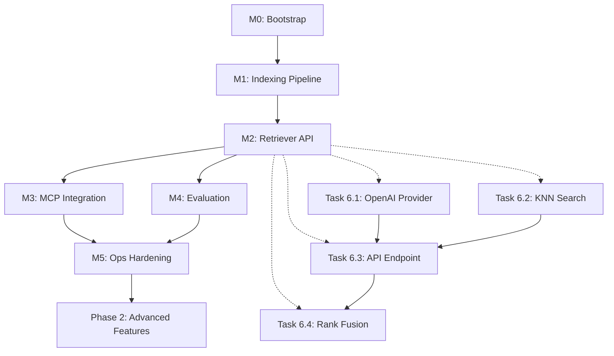

# MCP Code Intelligence Indexing System - Final Implementation Plan

**Document Version:** 1.0
**Date:** 2025-10-29
**Current Phase:** Phase 6 (M2 In Progress)
**Target Completion:** Phase 7 Complete (~2-3 weeks)

---

## Executive Summary

This document provides a centralized, actionable implementation plan to complete the MCP Code Intelligence Indexing System. The indexing pipeline (M0-M1) is complete and operational. The remaining work focuses on:

1. **M2**: Retriever API implementation (search backend)
2. **M3**: MCP server integration
3. **M4**: Evaluation harness and metrics
4. **M5**: Operational hardening (hooks, monitoring)
5. **Phase 2**: Advanced features (graph, hybrid search, reranking)

**Estimated Total Effort:** 80-120 hours over 2-3 weeks for core completion (M2-M4), additional 40-60 hours for M5 and Phase 2 features.

---

## Project Status Overview

### ✅ Completed Components (M0-M1)

| Component | Status | Location | Notes |
|-----------|--------|----------|-------|
| SQLite Metadata Store | ✅ Complete | `knowledge/storage/sql_store.py` | Repos, sessions, files, chunks |
| LanceDB Vector Store | ✅ Complete | `knowledge/storage/lance_store.py` | Per-model collections |
| Symbol Extraction | ✅ Complete | `knowledge/parsing/chunkers/` | Python, TS, Markdown via tree-sitter |
| Content-Addressed Chunking | ✅ Complete | `knowledge/indexing/chunker.py` | Deduplication working |
| Embedding Pipeline | ✅ Complete | `knowledge/indexing/embedder.py` | Stub provider (needs real API) |
| Incremental Indexing | ✅ Complete | `knowledge/indexing/session.py` | Git-diff based |
| CLI Tools | ✅ Complete | `knowledge/cli.py` | init, add-repo, index, status, prune |

### ⚠️ In Progress (M2)

| Component | Status | Blockers | Priority |
|-----------|--------|----------|----------|
| Retriever API | 🟡 Partial | Search backend not implemented | P0 |
| Query Embedding | 🟡 Stub | OpenAI API integration needed | P0 |
| KNN Search | ❌ Missing | LanceDB query logic needed | P0 |
| Result Ranking | ❌ Missing | Rank fusion algorithm needed | P1 |

### ❌ Pending (M3-M5)

| Milestone | Components | Estimated Effort | Dependencies |
|-----------|-----------|------------------|--------------|
| M3: MCP Integration | MCP server wrapper, tool registration | 8-12 hours | M2 complete |
| M4: Evaluation | Test queries, metrics (P@5, R@10, MRR) | 12-16 hours | M2 complete |
| M5: Ops Hardening | Error recovery, post-commit hook, monitoring | 16-24 hours | M3 complete |

---

## Phase-by-Phase Implementation Plan

## **PHASE 6: Complete M2 - Retriever API** (Priority: P0, 24-32 hours)

### Objective
Implement functional search backend with query embedding, KNN search, and basic ranking.

### Tasks

#### Task 6.1: Implement OpenAI Embedding Provider (6-8 hours)
**File:** `knowledge/embedding/providers/openai_provider.py`

**Current State:** Stub provider returns zero-vectors

**Implementation Steps:**
1. Add OpenAI SDK dependency (`openai>=1.0.0`) to requirements
2. Implement `OpenAIEmbeddingProvider`:
   ```python
   class OpenAIEmbeddingProvider(EmbeddingProvider):
       def __init__(self, api_key: str, model: str = "text-embedding-3-small"):
           self.client = openai.OpenAI(api_key=api_key)
           self.model = model

       def embed_batch(self, texts: list[str]) -> list[list[float]]:
           response = self.client.embeddings.create(
               input=texts,
               model=self.model
           )
           return [item.embedding for item in response.data]
   ```
3. Add configuration to `knowledge/config.yaml`:
   ```yaml
   embedding:
     provider: openai
     model: text-embedding-3-small
     api_key_env: OPENAI_API_KEY
     batch_size: 100
   ```
4. Update `knowledge/embedding/factory.py` to instantiate OpenAI provider
5. Add retry logic for API failures (exponential backoff)
6. Add unit tests with mocked API responses

**Acceptance Criteria:**
- [ ] Embedding provider successfully embeds text using OpenAI API
- [ ] Batch processing works with configurable batch size
- [ ] API key loaded from environment variable
- [ ] Retry logic handles transient failures
- [ ] Unit tests pass with >90% coverage

---

#### Task 6.2: Implement LanceDB KNN Search Backend (8-10 hours)
**File:** `knowledge/retrieval/backends/lance_backend.py`

**Current State:** Search protocol defined, implementation missing

**Implementation Steps:**
1. Implement `LanceDBSearchBackend`:
   ```python
   class LanceDBSearchBackend(SearchBackend):
       def __init__(self, lance_store: LanceStore, sql_store: SQLStore):
           self.lance_store = lance_store
           self.sql_store = sql_store

       def search(
           self,
           query_embedding: list[float],
           model_name: str,
           top_k: int = 20,
           filters: Optional[dict] = None
       ) -> list[SearchResult]:
           # 1. Query LanceDB collection
           collection = self.lance_store.get_collection(model_name)
           results = collection.search(query_embedding).limit(top_k).to_list()

           # 2. Hydrate chunk metadata from SQL
           chunk_ids = [r["chunk_id"] for r in results]
           chunks = self.sql_store.get_chunks_by_ids(chunk_ids)

           # 3. Build SearchResult objects with scores
           return [
               SearchResult(
                   chunk_id=chunk.chunk_id,
                   content=chunk.content,
                   score=result["_distance"],
                   locations=chunk.locations,
                   metadata=chunk.metadata
               )
               for result, chunk in zip(results, chunks)
           ]
   ```

2. Add filter support for repository/file path:
   ```python
   # LanceDB SQL-like filtering
   filter_expr = None
   if filters:
       if "repo_path" in filters:
           filter_expr = f"repo_path = '{filters['repo_path']}'"
   ```

3. Implement `SearchResult` dataclass in `knowledge/retrieval/types.py`:
   ```python
   @dataclass
   class SearchResult:
       chunk_id: str
       content: str
       score: float
       locations: list[ChunkLocation]
       metadata: dict
   ```

4. Add method to `SQLStore` to batch-fetch chunks:
   ```python
   def get_chunks_by_ids(self, chunk_ids: list[str]) -> list[ChunkContent]:
       with self.session() as session:
           return session.query(ChunkContent).filter(
               ChunkContent.chunk_id.in_(chunk_ids)
           ).all()
   ```

5. Add integration tests with real LanceDB queries
6. Benchmark query latency (target <100ms p50)

**Acceptance Criteria:**
- [ ] KNN search returns top-K results with cosine similarity scores
- [ ] Repository/file path filtering works correctly
- [ ] Chunk metadata properly hydrated from SQL
- [ ] Query latency <100ms for p50, <300ms for p99
- [ ] Integration tests pass with real embeddings

---

#### Task 6.3: Wire Retriever API Endpoint (6-8 hours)
**File:** `knowledge/api/routes.py`

**Current State:** FastAPI scaffold exists, `/v1/search` returns mock data

**Implementation Steps:**
1. Update `/v1/search` endpoint:
   ```python
   from knowledge.retrieval.retriever import Retriever
   from knowledge.embedding.factory import create_embedding_provider

   @app.post("/v1/search")
   async def search(request: SearchRequest) -> SearchResponse:
       # 1. Embed query
       provider = create_embedding_provider()
       query_embedding = provider.embed([request.query])[0]

       # 2. Search backend
       retriever = Retriever(
           backend=lance_backend,
           sql_store=sql_store
       )
       results = retriever.search(
           query_embedding=query_embedding,
           model_name=request.model or "text-embedding-3-small",
           top_k=request.top_k or 10,
           filters={"repo_path": request.repo_path} if request.repo_path else None
       )

       # 3. Format response
       return SearchResponse(
           results=[
               {
                   "chunk_id": r.chunk_id,
                   "content": r.content,
                   "score": r.score,
                   "locations": [loc.dict() for loc in r.locations]
               }
               for r in results
           ],
           query=request.query,
           total_results=len(results)
       )
   ```

2. Define request/response models:
   ```python
   class SearchRequest(BaseModel):
       query: str
       top_k: Optional[int] = 10
       model: Optional[str] = None
       repo_path: Optional[str] = None

   class SearchResponse(BaseModel):
       results: list[dict]
       query: str
       total_results: int
   ```

3. Add error handling for missing embeddings, invalid queries
4. Add request validation (max query length, valid top_k range)
5. Add OpenAPI documentation
6. Add end-to-end API tests using `httpx.AsyncClient`

**Acceptance Criteria:**
- [ ] `/v1/search` endpoint returns real results from LanceDB
- [ ] Query embedding generated using OpenAI API
- [ ] Error responses have clear messages and correct status codes
- [ ] API documentation complete in Swagger UI
- [ ] E2E tests verify full search flow

---

#### Task 6.4: Implement Basic Rank Fusion (4-6 hours)
**File:** `knowledge/retrieval/rankers.py`

**Current State:** Not implemented

**Implementation Steps:**
1. Implement reciprocal rank fusion (RRF):
   ```python
   def reciprocal_rank_fusion(
       result_lists: list[list[SearchResult]],
       k: int = 60
   ) -> list[SearchResult]:
       """
       Merge multiple ranked lists using RRF.
       Score = sum(1 / (k + rank_i)) for each list where item appears.
       """
       scores: dict[str, float] = defaultdict(float)
       results_by_id: dict[str, SearchResult] = {}

       for result_list in result_lists:
           for rank, result in enumerate(result_list, start=1):
               scores[result.chunk_id] += 1 / (k + rank)
               results_by_id[result.chunk_id] = result

       # Sort by RRF score descending
       sorted_ids = sorted(scores.keys(), key=lambda x: scores[x], reverse=True)

       return [
           SearchResult(
               **results_by_id[chunk_id].__dict__,
               score=scores[chunk_id]  # Replace with RRF score
           )
           for chunk_id in sorted_ids
       ]
   ```

2. Update `Retriever` to support multi-stage retrieval:
   ```python
   class Retriever:
       def search_with_fusion(
           self,
           query_embedding: list[float],
           query_text: str,
           top_k: int = 10
       ) -> list[SearchResult]:
           # Stage 1: Vector search
           vector_results = self.backend.search(query_embedding, top_k=50)

           # Stage 2: BM25 (future - placeholder)
           # bm25_results = self.bm25.search(query_text, top_k=50)

           # Rank fusion
           # fused = reciprocal_rank_fusion([vector_results, bm25_results])
           fused = vector_results  # Single-stage for now

           return fused[:top_k]
   ```

3. Add unit tests for RRF with known rankings
4. Add configuration for fusion parameters (k value, weights)

**Acceptance Criteria:**
- [ ] RRF correctly merges multiple ranked lists
- [ ] Retriever supports configurable ranking strategies
- [ ] Unit tests verify RRF math is correct
- [ ] Placeholder exists for future BM25 integration

---

## **PHASE 7: Complete M3 - MCP Integration** (Priority: P0, 8-12 hours)

### Objective
Expose retriever as MCP tool for use in Claude Desktop, Continue, and other MCP clients.

### Tasks

#### Task 7.1: Implement MCP Server Wrapper (6-8 hours)
**File:** `mcp/retriever_server.py`

**Current State:** Not implemented

**Implementation Steps:**
1. Install MCP SDK: `pip install mcp`
2. Create MCP server:
   ```python
   from mcp.server import Server, Tool
   from knowledge.retrieval.retriever import Retriever
   from knowledge.embedding.factory import create_embedding_provider

   app = Server("code-intelligence")

   @app.tool()
   async def search_knowledge(
       query: str,
       top_k: int = 10,
       repo_path: str | None = None
   ) -> dict:
       """
       Search the code knowledge base for relevant code snippets.

       Args:
           query: Natural language query or code search
           top_k: Number of results to return (default 10)
           repo_path: Optional repository path filter

       Returns:
           Search results with code snippets and locations
       """
       # Embed query
       provider = create_embedding_provider()
       query_embedding = provider.embed([query])[0]

       # Search
       retriever = get_retriever()  # Singleton instance
       results = retriever.search(
           query_embedding=query_embedding,
           top_k=top_k,
           filters={"repo_path": repo_path} if repo_path else None
       )

       # Format for MCP
       return {
           "results": [
               {
                   "content": r.content,
                   "file": r.locations[0].file_path if r.locations else None,
                   "line_start": r.locations[0].line_start if r.locations else None,
                   "score": r.score
               }
               for r in results
           ]
       }

   if __name__ == "__main__":
       app.run()
   ```

3. Create startup script `mcp/run_server.sh`:
   ```bash
   #!/bin/bash
   export OPENAI_API_KEY=${OPENAI_API_KEY}
   export KB_DATA_DIR=${KB_DATA_DIR:-~/.knowledge}
   python -m mcp.retriever_server
   ```

4. Add MCP configuration example for Claude Desktop:
   ```json
   // ~/Library/Application Support/Claude/claude_desktop_config.json
   {
     "mcpServers": {
       "code-intelligence": {
         "command": "/path/to/dolphin/mcp/run_server.sh",
         "env": {
           "OPENAI_API_KEY": "sk-...",
           "KB_DATA_DIR": "/Users/you/.knowledge"
         }
       }
     }
   }
   ```

5. Add integration tests that invoke MCP tool
6. Test with Claude Desktop and Continue

**Acceptance Criteria:**
- [ ] MCP server starts without errors
- [ ] `search_knowledge` tool registered and discoverable
- [ ] Tool executes successfully in Claude Desktop
- [ ] Results formatted correctly for LLM consumption
- [ ] Configuration examples documented

---

#### Task 7.2: Add Continue Context Provider (2-4 hours)
**File:** `mcp/continue_provider.py`

**Current State:** Not implemented

**Implementation Steps:**
1. Create Continue context provider config:
   ```json
   // .continue/config.json
   {
     "contextProviders": [
       {
         "name": "code-intelligence",
         "params": {
           "serverUrl": "http://localhost:8000",
           "topK": 5
         }
       }
     ]
   }
   ```

2. Verify retriever API works with Continue's HTTP client
3. Add example queries to documentation
4. Test context injection in Continue chat

**Acceptance Criteria:**
- [ ] Continue can query retriever API
- [ ] Context injected into Continue prompts
- [ ] Documentation includes setup instructions

---

## **PHASE 8: Complete M4 - Evaluation Harness** (Priority: P1, 12-16 hours)

### Objective
Validate retrieval quality with quantitative metrics (P@5, R@10, MRR).

### Tasks

#### Task 8.1: Create Evaluation Dataset (4-6 hours)
**File:** `evaluation/queries.yaml`

**Current State:** Not created

**Implementation Steps:**
1. Create 15-20 test queries with ground truth:
   ```yaml
   queries:
     - id: q001
       query: "How do I initialize the knowledge base?"
       relevant_chunks:
         - chunk_id: "abc123..."
           file: "knowledge/cli.py"
           symbol: "init_command"
         - chunk_id: "def456..."
           file: "knowledge/storage/sql_store.py"
           symbol: "SQLStore.initialize"

     - id: q002
       query: "Where are embeddings stored?"
       relevant_chunks:
         - chunk_id: "ghi789..."
           file: "knowledge/storage/lance_store.py"
           symbol: "LanceStore"
   ```

2. Categories to cover:
   - **How-to queries**: "How do I add a repository?"
   - **Where queries**: "Where is symbol extraction implemented?"
   - **Definition queries**: "What is a chunk_id?"
   - **Conceptual queries**: "How does incremental indexing work?"

3. Manually annotate relevant chunks by:
   - Running queries against indexed codebase
   - Reviewing top-20 results
   - Marking relevant vs. irrelevant

4. Validate dataset has good coverage:
   - 50+ unique relevant chunks across queries
   - Avg 3-5 relevant chunks per query
   - Mix of high-frequency (CLI) and low-frequency (storage internals) targets

**Acceptance Criteria:**
- [ ] 15-20 queries with ground truth annotations
- [ ] Queries cover diverse intents (how-to, where, what, why)
- [ ] Relevant chunks verified manually
- [ ] Dataset saved in YAML format

---

#### Task 8.2: Implement Metrics Computation (4-6 hours)
**File:** `evaluation/metrics.py`

**Current State:** Not implemented

**Implementation Steps:**
1. Implement metrics:
   ```python
   def precision_at_k(results: list[str], relevant: set[str], k: int) -> float:
       """Precision@K = |relevant ∩ top-K| / K"""
       top_k = results[:k]
       return len(set(top_k) & relevant) / k

   def recall_at_k(results: list[str], relevant: set[str], k: int) -> float:
       """Recall@K = |relevant ∩ top-K| / |relevant|"""
       top_k = results[:k]
       return len(set(top_k) & relevant) / len(relevant)

   def mean_reciprocal_rank(results: list[str], relevant: set[str]) -> float:
       """MRR = 1 / rank of first relevant result"""
       for rank, result in enumerate(results, start=1):
           if result in relevant:
               return 1.0 / rank
       return 0.0

   def evaluate_query(
       query: str,
       relevant_chunks: set[str],
       retriever: Retriever,
       k_values: list[int] = [5, 10, 20]
   ) -> dict:
       """Evaluate single query."""
       # Get search results
       provider = create_embedding_provider()
       query_emb = provider.embed([query])[0]
       results = retriever.search(query_emb, top_k=max(k_values))
       result_ids = [r.chunk_id for r in results]

       # Compute metrics
       return {
           "query": query,
           "precision": {f"p@{k}": precision_at_k(result_ids, relevant_chunks, k) for k in k_values},
           "recall": {f"r@{k}": recall_at_k(result_ids, relevant_chunks, k) for k in k_values},
           "mrr": mean_reciprocal_rank(result_ids, relevant_chunks)
       }
   ```

2. Add aggregate reporting:
   ```python
   def evaluate_all(queries: list[dict], retriever: Retriever) -> dict:
       """Evaluate all queries and aggregate."""
       results = [
           evaluate_query(q["query"], set(q["relevant_chunks"]), retriever)
           for q in queries
       ]

       # Aggregate
       return {
           "p@5": mean([r["precision"]["p@5"] for r in results]),
           "p@10": mean([r["precision"]["p@10"] for r in results]),
           "r@10": mean([r["recall"]["r@10"] for r in results]),
           "mrr": mean([r["mrr"] for r in results]),
           "per_query": results
       }
   ```

3. Add CLI command:
   ```bash
   kb evaluate --queries evaluation/queries.yaml --output results.json
   ```

**Acceptance Criteria:**
- [ ] Metrics computed correctly (verified with hand-calculated examples)
- [ ] Aggregate and per-query results reported
- [ ] JSON output includes all metrics
- [ ] CLI command runs successfully

---

#### Task 8.3: Run Baseline Evaluation (4-6 hours)
**File:** `evaluation/baseline_results.json`

**Current State:** Not run

**Implementation Steps:**
1. Index test repository (dolphin codebase)
2. Run evaluation:
   ```bash
   kb evaluate --queries evaluation/queries.yaml --output evaluation/baseline_results.json
   ```
3. Analyze results:
   - Identify queries with low P@5 (<0.5)
   - Inspect false negatives (relevant chunks ranked low)
   - Inspect false positives (irrelevant chunks ranked high)
4. Document failure modes:
   - Does retriever fail on conceptual queries?
   - Does it over-weight file paths vs. content?
   - Are short chunks (imports) ranked too high?
5. Create improvement backlog based on findings

**Acceptance Criteria:**
- [ ] Baseline evaluation complete with documented results
- [ ] P@5 ≥ 0.60 (stretch goal: ≥0.70)
- [ ] R@10 ≥ 0.60 (stretch goal: ≥0.65)
- [ ] MRR ≥ 0.60 (stretch goal: ≥0.65)
- [ ] Failure analysis documented with examples

---

## **PHASE 9: Complete M5 - Operational Hardening** (Priority: P2, 16-24 hours)

### Objective
Make system production-ready with error recovery, automation, and monitoring.

### Tasks

#### Task 9.1: Add Checkpoint-Based Error Recovery (6-8 hours)
**Files:** `knowledge/indexing/session.py`, `knowledge/indexing/checkpoints.py`

**Current State:** Indexing restarts from scratch on failure

**Implementation Steps:**
1. Add checkpoint table to SQL schema:
   ```python
   class IndexingCheckpoint(SQLModel, table=True):
       __tablename__ = "indexing_checkpoints"

       id: int = Field(primary_key=True)
       session_id: str
       file_path: str
       chunks_processed: int
       timestamp: datetime
   ```

2. Update indexing loop to save checkpoints:
   ```python
   def index_file_with_checkpoints(file_path: str, session_id: str):
       # Check for existing checkpoint
       checkpoint = get_checkpoint(session_id, file_path)
       start_chunk = checkpoint.chunks_processed if checkpoint else 0

       chunks = extract_chunks(file_path)
       for i, chunk in enumerate(chunks[start_chunk:], start=start_chunk):
           try:
               process_chunk(chunk)
               # Save checkpoint every 100 chunks
               if i % 100 == 0:
                   save_checkpoint(session_id, file_path, i)
           except Exception as e:
               logger.error(f"Failed on chunk {i}: {e}")
               save_checkpoint(session_id, file_path, i)
               raise
   ```

3. Add CLI flag to resume from checkpoint:
   ```bash
   kb index --resume-session <session-id>
   ```

4. Add cleanup logic to purge old checkpoints after successful completion

**Acceptance Criteria:**
- [ ] Checkpoints saved during long-running indexing sessions
- [ ] Indexing resumes from last checkpoint on failure
- [ ] Resume tested with simulated failures
- [ ] Old checkpoints cleaned up automatically

---

#### Task 9.2: Implement Post-Commit Hook (4-6 hours)
**Files:** `hooks/post-commit`, `knowledge/hooks/git_hook.py`

**Current State:** Manual `kb index` required after commits

**Implementation Steps:**
1. Create Git hook installer:
   ```bash
   kb install-hook --repo /path/to/repo
   ```

2. Generate post-commit hook:
   ```bash
   #!/bin/bash
   # Auto-generated by kb install-hook
   KB_DATA_DIR=~/.knowledge
   REPO_PATH=$(git rev-parse --show-toplevel)

   # Run incremental indexing in background
   kb index --repo "$REPO_PATH" --incremental --background
   ```

3. Implement background indexing:
   ```python
   @click.option("--background", is_flag=True)
   def index_command(repo: str, incremental: bool, background: bool):
       if background:
           # Fork process and detach
           pid = os.fork()
           if pid > 0:
               return  # Parent exits immediately
           # Child continues indexing

       run_indexing(repo, incremental)
   ```

4. Add logging to `~/.knowledge/logs/indexing.log`
5. Add failure notifications (optional: desktop notification on error)

**Acceptance Criteria:**
- [ ] Hook installed successfully via CLI command
- [ ] Post-commit triggers incremental indexing
- [ ] Background indexing doesn't block git operations
- [ ] Logs written to persistent file
- [ ] Hook works across multiple repos

---

#### Task 9.3: Add Monitoring and Observability (6-10 hours)
**Files:** `knowledge/observability/metrics.py`, `knowledge/api/middleware.py`

**Current State:** No metrics collection

**Implementation Steps:**
1. Add Prometheus metrics:
   ```python
   from prometheus_client import Counter, Histogram, Gauge

   # Indexing metrics
   chunks_indexed = Counter("kb_chunks_indexed_total", "Total chunks indexed")
   indexing_duration = Histogram("kb_indexing_duration_seconds", "Time to index file")
   index_size = Gauge("kb_index_size_bytes", "Total index size")

   # Retrieval metrics
   search_latency = Histogram("kb_search_latency_seconds", "Search query latency")
   search_requests = Counter("kb_search_requests_total", "Total search requests")
   ```

2. Instrument code:
   ```python
   # In indexer
   with indexing_duration.time():
       chunks = index_file(file_path)
   chunks_indexed.inc(len(chunks))

   # In retriever
   start = time.time()
   results = search(query)
   search_latency.observe(time.time() - start)
   search_requests.inc()
   ```

3. Add `/metrics` endpoint to FastAPI:
   ```python
   from prometheus_client import generate_latest

   @app.get("/metrics")
   def metrics():
       return Response(generate_latest(), media_type="text/plain")
   ```

4. Create Grafana dashboard JSON:
   - Panel: Indexing throughput (chunks/sec)
   - Panel: Search latency p50/p90/p99
   - Panel: Index size growth over time
   - Panel: Error rate

5. Add health check endpoint:
   ```python
   @app.get("/v1/health")
   def health():
       return {
           "status": "healthy",
           "index_size_mb": get_index_size_mb(),
           "indexed_repos": get_repo_count(),
           "total_chunks": get_chunk_count()
       }
   ```

**Acceptance Criteria:**
- [ ] Prometheus metrics exported at `/metrics`
- [ ] Key metrics instrumented (latency, throughput, size)
- [ ] Grafana dashboard displays metrics
- [ ] Health check returns useful diagnostics
- [ ] Metrics tested with load testing tool

---

## **PHASE 10: Advanced Features (Phase 2)** (Priority: P3, 40-60 hours)

### Objective
Implement advanced retrieval capabilities for improved accuracy and recall.

### Tasks (High-Level)

#### Task 10.1: Implement Symbol Store with Module Computation (12-16 hours)
- Add `symbol_module` field to chunker output
- Implement module inference from file paths and imports
- Populate symbol table with global IDs (`python://repo/module.Symbol`)
- Add symbol lookup endpoint for exact-match queries

#### Task 10.2: Add Multi-Chunk Sequencing (6-8 hours)
- Detect long symbols that span multiple chunks
- Add `sequence_index` and `total_sequences` to chunk metadata
- Update context assembly to stitch multi-chunk symbols

#### Task 10.3: Implement BM25 Keyword Search (10-12 hours)
- Index chunk content in SQLite FTS5 table
- Implement BM25 scoring algorithm
- Add BM25 backend to retrieval pipeline
- Update rank fusion to merge vector + BM25 results

#### Task 10.4: Add Graph Edge Inference (12-16 hours)
- Extract CALLS edges from AST (function calls)
- Extract IMPORTS edges from import statements
- Extract TESTS edges (test function → implementation)
- Store edges in `symbol_edges` table with confidence scores
- Implement 1-hop graph expansion after initial retrieval

#### Task 10.5: Implement Reranking with Cross-Encoder (8-10 hours)
- Add cross-encoder model (e.g., `ms-marco-MiniLM-L6`)
- Rerank top-50 vector results to top-10
- Compare performance with/without reranking
- Add reranking latency to metrics

---

## Dependency Graph



---

## Success Metrics

### M2: Retriever API
- [ ] Search latency p50 < 100ms, p99 < 300ms
- [ ] API uptime > 99% (basic health checks)
- [ ] Zero-downtime deploys (future: Docker)

### M3: MCP Integration
- [ ] MCP tool accessible in Claude Desktop
- [ ] Continue context provider functional
- [ ] Zero errors in MCP server logs during normal operation

### M4: Evaluation
- [ ] **P@5 ≥ 0.70** (Precision at 5)
- [ ] **R@10 ≥ 0.65** (Recall at 10)
- [ ] **MRR ≥ 0.65** (Mean Reciprocal Rank)
- [ ] 15+ test queries with ground truth

### M5: Operational Hardening
- [ ] Post-commit hook indexes changes automatically
- [ ] Indexing recovers from crashes with <5% data loss (checkpointing)
- [ ] Monitoring dashboard shows key metrics in real-time
- [ ] Error rate < 0.1% for API requests

### Phase 2: Advanced Features
- [ ] Graph expansion improves R@10 by ≥10% (relative)
- [ ] BM25 + vector fusion improves MRR by ≥5%
- [ ] Reranking improves P@5 by ≥10%

---

## Risk Mitigation

| Risk | Impact | Likelihood | Mitigation |
|------|--------|------------|------------|
| OpenAI API rate limits | High | Medium | Implement exponential backoff, request batching, caching |
| LanceDB performance issues | High | Low | Benchmark early, consider HNSW index tuning |
| Poor retrieval quality | High | Medium | Evaluate early (M4), iterate on chunking/ranking |
| MCP integration complexity | Medium | Medium | Test with simple tool first, read MCP docs thoroughly |
| Post-commit hook conflicts | Low | Medium | Make hook opt-in, allow disable flag |

---

## Timeline and Effort Estimates

| Phase | Tasks | Estimated Hours | Target Completion |
|-------|-------|-----------------|-------------------|
| Phase 6 (M2) | 4 tasks | 24-32 hours | Week 1 |
| Phase 7 (M3) | 2 tasks | 8-12 hours | Week 1-2 |
| Phase 8 (M4) | 3 tasks | 12-16 hours | Week 2 |
| Phase 9 (M5) | 3 tasks | 16-24 hours | Week 2-3 |
| **Total Core** | **12 tasks** | **60-84 hours** | **~2-3 weeks** |
| Phase 10 (P2) | 5 tasks | 40-60 hours | Week 4-6 |

**Assumptions:**
- Single developer, full-time focus
- Part-time (50%): Double timeline to 4-6 weeks for core, 8-12 weeks for Phase 2

---

## Next Steps (Immediate Actions)

### This Week (Week 1)
1. **Day 1-2**: Complete Task 6.1 (OpenAI Provider) + Task 6.2 (KNN Search)
2. **Day 3**: Complete Task 6.3 (API Endpoint)
3. **Day 4**: Complete Task 6.4 (Rank Fusion) + integration testing
4. **Day 5**: Start Task 7.1 (MCP Server)

### Next Week (Week 2)
1. Complete M3 (MCP Integration)
2. Create evaluation dataset (Task 8.1)
3. Implement metrics (Task 8.2)
4. Run baseline evaluation (Task 8.3)

### Week 3
1. Implement error recovery (Task 9.1)
2. Implement post-commit hook (Task 9.2)
3. Add monitoring (Task 9.3)
4. **Milestone: M5 Complete, System Production-Ready**

---

## Appendix: Configuration Examples

### Environment Variables
```bash
export OPENAI_API_KEY=sk-...
export KB_DATA_DIR=~/.knowledge
export KB_LOG_LEVEL=INFO
export KB_API_PORT=8000
```

### Config File (`knowledge/config.yaml`)
```yaml
embedding:
  provider: openai
  model: text-embedding-3-small
  api_key_env: OPENAI_API_KEY
  batch_size: 100

storage:
  sql_uri: sqlite:///${KB_DATA_DIR}/metadata.db
  lance_uri: ${KB_DATA_DIR}/vectors

retrieval:
  default_top_k: 10
  max_top_k: 100
  rank_fusion:
    method: rrf
    k: 60

api:
  host: 0.0.0.0
  port: 8000
  workers: 4
```

### MCP Server Config (Claude Desktop)
```json
{
  "mcpServers": {
    "code-intelligence": {
      "command": "/Users/you/dolphin/mcp/run_server.sh",
      "env": {
        "OPENAI_API_KEY": "sk-...",
        "KB_DATA_DIR": "/Users/you/.knowledge"
      }
    }
  }
}
```

---

## Document Change Log

| Version | Date | Author | Changes |
|---------|------|--------|---------|
| 1.0 | 2025-10-29 | TDC | Initial comprehensive implementation plan |

---

**End of Implementation Plan**
