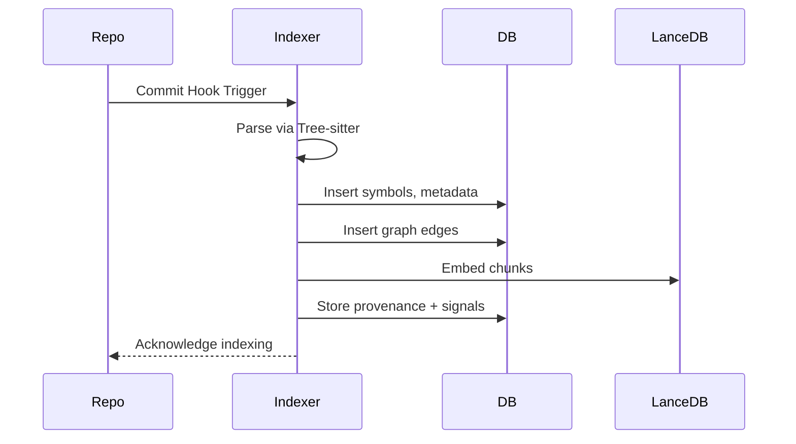

# MCP Code Intelligence Indexing Architecture

**Version:** 0.3  
**Status:** Detailed Specification  
**Author:** Taylor Cathcart  
**Date:** 2025-10-29

---

## Overview

This document specifies the **MCP Code Intelligence Indexing System** — a framework for semantic retrieval and LLM-aided reasoning over large codebases. The system decomposes repositories into AST-bounded code chunks, embeds them in a vector space, connects them via a graph, and returns structured metadata for contextually aware inference.

The goal: to provide an **LLM-native retrieval substrate** that unites structural precision (from Tree-sitter) with semantic generalization (from embeddings), enabling natural-language reasoning over source code, tests, and documentation.

---

## Objectives

1. **Semantic precision**: Retrieve relevant code for natural-language queries.  
2. **Symbolic structure**: Preserve identifiers, scopes, and file-level anchors.  
3. **Graph context**: Model calls, dependencies, and test relationships.  
4. **Scalability**: Support asynchronous indexing triggered by post-commit hooks.  
5. **Hybrid performance**: Blend SQL for metadata and LanceDB for vectors.  
6. **Extensibility**: Add polyglot language support progressively.

---

## Architecture

### Components Overview

```mermaid
flowchart TD
  A[Repo Commit Hook] -->|AST Extraction| B[Chunker (Tree-sitter)]
  B --> C[Chunk Store + Embeddings]
  B --> D[Symbol Store]
  B --> E[Graph Builder]
  C --> F[LanceDB Vector Index]
  D --> G[SQL Metadata DB]
  E --> G
  F --> H[MCP Retriever]
  G --> H
  H --> I[LLM / API Consumer]
```

---

## Data Model

### 1. Symbol Store (SQL)

Holds all named entities for exact resolution and metadata enrichment.

| Field | Type | Description |
|-------|------|-------------|
| `symbol_id` | TEXT PK | Global unique identifier (e.g., `py://pkg.mod.Class.method`) |
| `name` | TEXT | Symbol name |
| `kind` | TEXT | Function, Class, Method, Type, Const |
| `language` | TEXT | python, typescript, markdown |
| `file_path` | TEXT | File in repo |
| `start_byte` | INT | Start offset |
| `end_byte` | INT | End offset |
| `signature` | TEXT | Function or class signature |
| `docstring` | TEXT | Extracted docstring |
| `exported` | BOOL | Whether public/exported |
| `repo_id` | TEXT | Repository name |
| `commit` | TEXT | Commit SHA |
| `hash_anchor` | TEXT | Stable content hash |

**Indexing logic:** Each Tree-sitter node representing a top-level declaration is transformed into a symbol record with a deterministic ID. Relationships to parent and child nodes are recorded as graph edges.

---

### 2. Chunk Store (SQL + LanceDB)

Chunks represent atomic retrieval units. Each corresponds roughly to a function, class, or Markdown section.

| Field | Type | Description |
|-------|------|-------------|
| `chunk_id` | TEXT PK | Content hash |
| `file_path` | TEXT | Path in repo |
| `language` | TEXT | Language |
| `symbol_ids` | ARRAY | Linked symbols |
| `content` | TEXT | Raw text |
| `prefix_context` | TEXT | Few lines before |
| `suffix_context` | TEXT | Few lines after |
| `embedding` | VECTOR | Semantic vector |
| `token_count` | INT | Token length |
| `repo_id` | TEXT | Repository ID |
| `commit` | TEXT | Commit hash |

**Chunking strategy:**
- For Python/TS: functions and classes are chunk boundaries.  
- For Markdown: headings define chunk boundaries.  
- Prefix/suffix adds overlapping context for coherence.  
- Each chunk generates three embeddings: code, doc, and hybrid.

---

### 3. Graph Overlay

```mermaid
graph LR
  A[Symbol: foo()] -->|CALLS| B[Symbol: bar()]
  A -->|TESTED_BY| C[TestCaseFoo]
  D[Module A] -->|IMPORTS| E[Module B]
  F[Doc.md Section] -->|DOCUMENTS| A
```

Each edge type enables 1-hop context expansion.

| Type | Description |
|------|--------------|
| CALLS | Function calls another function |
| IMPORTS | Module or file import |
| IMPLEMENTS / OVERRIDES | Class inheritance |
| TESTS / TESTED_BY | Link tests to code |
| DOCUMENTS | Markdown/ADR links |
| COCHANGED_WITH | Derived from git history |

Each node caches small summaries for fast inclusion in LLM prompts.

---

### 4. Provenance / Signals

Captures quality, ownership, and freshness.

| Field | Type | Description |
|-------|------|-------------|
| `repo_id` | TEXT | Repository |
| `commit_hash` | TEXT | Commit |
| `author` | TEXT | Last modifier |
| `coverage` | REAL | Test coverage |
| `churn_30d` | INT | Edits in last month |
| `owners` | TEXT[] | Code owners |
| `last_modified` | TIMESTAMP | Recent change |
| `embedding_version` | TEXT | Model used |
| `embedding_dim` | INT | Dimensionality |
| `visibility` | TEXT | internal/public |

---

## Indexing Workflow



**Process:**  
1. Commit hook triggers asynchronous job.  
2. Chunker extracts symbols and chunks.  
3. Embeddings computed and stored in LanceDB.  
4. Metadata written to SQL (SQLite or Postgres).  
5. Graph relationships inserted.  
6. Provenance updated.

---

## Retrieval Flow

```mermaid
flowchart LR
  Q[User Query] --> P[Query Parser]
  P --> BM25[Keyword Index]
  P --> V[Vector Search (LanceDB)]
  P --> S[Symbol Lookup (SQL)]
  BM25 --> R[Fusion Ranker]
  V --> R
  S --> R
  R --> G[Graph Expander (1-Hop)]
  G --> C[Context Builder]
  C --> MCP[MCP Response → LLM]
```

---

## MCP Response Schema

The MCP tool returns rich JSON objects with provenance and graph context:

```json
{
  "type": "code_chunk",
  "rank": 1,
  "score": 0.83,
  "chunk_id": "blake3:abc123",
  "symbol": {"symbol_id": "py://pkg.mod.fn", "kind": "function"},
  "location": {"repo_id": "repo", "commit": "abc1234", "file_path": "src/mod.py"},
  "content": "def foo(): ...",
  "graph": {"calls": ["bar"], "docs": ["docs/usage.md"]},
  "signals": {"coverage": 0.7, "last_modified": "2025-10-12"},
  "provenance": {"embedding_version": "e5-large-v3"}
}
```

---

## Implementation Plan

### Phase 1 — Core Indexing (Python, TS, Markdown)

- [x] Implement Tree-sitter parsers and AST walkers.  
- [x] Build `symbols`, `chunks`, and `graph_edges` tables.  
- [x] Integrate LanceDB for vector storage.  
- [ ] Add CLI for post-commit indexing (`mcp-index`).  
- [ ] Expose simple search endpoint via MCP API.

### Phase 2 — Graph Expansion + Hybrid Retrieval

- [ ] Implement graph enrichment (CALLS, IMPORTS, TESTS).  
- [ ] Add BM25 index for keyword recall.  
- [ ] Implement reciprocal rank fusion.  
- [ ] Bundle top N results with 1-hop neighbors.

### Phase 3 — Provenance + Ranking Signals

- [ ] Integrate git blame for `author` and `churn_30d`.  
- [ ] Add coverage ingestion (pytest or nyc).  
- [ ] Store owner and license info.  
- [ ] Tune scoring weights for freshness and quality.

### Phase 4 — Polyglot + Context Optimization

- [ ] Add support for Go, Rust, C#.  
- [ ] Optimize chunker for large files (token-based slicing).  
- [ ] Precompute “neighborhood summaries”.  
- [ ] Integrate near-duplicate suppression (minhash).

---

## Performance Targets

| Metric | Goal |
|--------|------|
| Retrieval latency | < 300 ms (10k chunks) |
| Embedding throughput | 10k chunks/min with batching |
| Index refresh | ≤ 2 min post-commit |
| Query response | ≤ 100 ms SQL + ≤ 150 ms vector |

---

## Future Enhancements

- Query rewriting using LLM to improve recall.  
- Semantic deduplication of context.  
- Caching frequent query graphs.  
- Schema migrations for new embedding models.  
- Cross-repo dependency mapping.

---

## Summary

This specification defines a scalable, hybrid semantic indexing architecture for LLM-assisted code understanding. It unifies syntax, semantics, and provenance in a single retrieval substrate, optimized for both recall and interpretability.

The next step is implementation of **Phase 1 Core Indexing** followed by early retrieval experiments on real-world repositories.

