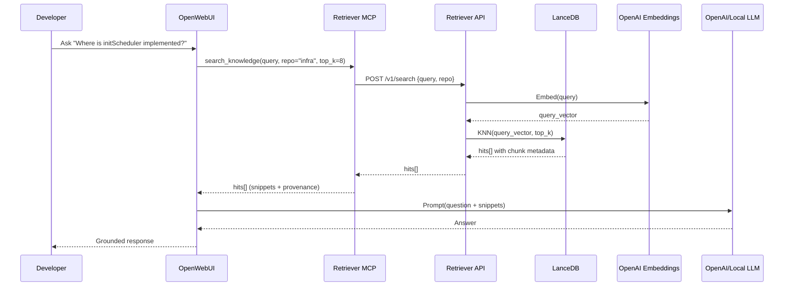

# Unified Knowledge Store + Pipelines (Sprint 1, Section 1)

Purpose
1) Provide high-quality, low-friction repo/document retrieval to power coding and research workflows in OpenWebUI and Continue (VSCode).
2) Optimize for local operation on MacBook Pro (M4 Pro, 24 GB RAM) with cost-awareness. Use OpenAI embeddings now; keep a clean path to local OSS later.
3) Emphasize simplicity first while designing clear seams for upgrades (hybrid search, reranking, watch mode, planner/executor routing).

Scope and constraints
1) Sources: code and Markdown inside repos. No PDFs/OCR. Small data.
2) Languages: TypeScript and Python prioritized, extensible to others. Use code-aware chunking.
3) Embeddings: OpenAI text-embedding-3-small (default) with per-repo override to text-embedding-3-large.
4) Storage: LanceDB (vectors) + SQLite (metadata) under ~/.plastic_beach/knowledge_store.
5) Redaction/ignore: exclude .env/.env.* and common build/vendor directories; OK to send code to OpenAI after exclusion.
6) Budget: target well under $200/month; enforce $10/session cap for indexing jobs.
7) Package management: uv exclusively (no pip). Use pyproject.toml with uv-managed lockfile and scripts.

High-level architecture
1) Components
   - Ingestion CLI (kb): Scans repos, applies ignore rules, parses and chunks code/docs, hashes for idempotency, embeds with OpenAI, writes vectors to LanceDB and metadata to SQLite.
   - Retriever HTTP Service: FastAPI app that embeds queries and searches LanceDB; returns ranked snippets with provenance.
   - Retriever MCP Wrapper: MCP tool that proxies OpenWebUI tool calls to the retriever HTTP API.
   - Continue Context Provider: VSCode Continue configured to call the retriever service as a context source.
   - Data Stores: LanceDB (ANN vector index) and SQLite (repo/file/chunk/session metadata, ledgers, config).

2) Technology choices (frozen for Sprint 1)
   - Embeddings: OpenAI text-embedding-3-small (1536 dims) default; text-embedding-3-large (3072 dims) optional per collection.
   - Chunking: target 350 tokens (configurable per-repo), 10% overlap; tree-sitter for TS/Python; line-based fallback.
   - Repository Configuration: Per-repo `.dolphin/chunking_config.toml` files for custom token windows and embedding models, integrated with global configuration in `.dolphin/config.toml`.
   - Retrieval: dense KNN only (top_k default 8). No reranker/BM25 yet.
   - Cost controls: deduplicate unchanged chunks via SHA256 content hash; per-session spend cap; backoff on rate limits.

How the pieces work together
1) Ingestion (index-time)
   - kb discovers files (honoring .gitignore and default ignores) and classifies language.
   - For TS/Python, kb uses tree-sitter to chunk by symbol (function/class/method). For unknown languages, kb uses line-windowing.
   - Each chunk is canonicalized and hashed; unchanged hashes are skipped to avoid re-embedding.
   - Chunks are batched and embedded via OpenAI. Results are written to LanceDB with metadata columns and to SQLite for provenance and cost ledgers.

2) Retrieval (query-time)
   - Client (Continue or OpenWebUI via MCP) calls Retriever /v1/search with query and optional repo/path scopes.
   - Service embeds the query with the matching embedding model (small/large) and runs ANN search in LanceDB.
   - Top-k chunks are returned with snippet text, file:line ranges, symbol context, and commit SHA.

3) End-to-end inference flow (RAG usage)
   - OpenWebUI agent or Continue collects the snippets and constructs a prompt containing the user question and retrieved code/doc context.
   - The prompt is sent to the chosen LLM (OpenAI or a local OSS model). This call is outside the retriever for Sprint 1, but the retriever’s outputs are structured to drop into LLM prompts cleanly (snippets are short, deduplicated, and annotated with provenance).
   - For write-actions (later), the agent proposes changes; git MCP performs branch/commit/PR under approvals.

4) Sequence (conceptual)


Process flows in detail
1) Index-time flow
   1. Enumerate files → apply ignore sets and .gitignore.
   2. Load repository chunking configuration from `.dolphin/chunking_config.toml` (or use defaults).
   3. Parse and chunk (tree-sitter for TS/Py; fallback otherwise) using repo-specific token windows.
   4. Canonicalize + hash chunks → skip unchanged.
   5. Batch-embed with OpenAI (concurrency 2–4; backoff on 429/5xx) using repo-configured model.
   6. Persist to LanceDB (vectors + metadata) and SQLite (provenance + session ledger).
   7. Emit summary and enforce per-session cost cap (abort gracefully if reached).

2) Query-time flow
   1. Receive query + scope.
   2. Embed with the appropriate model (small/large per collection).
   3. Search LanceDB ANN index; filter by repo/path.
   4. Truncate snippets to max_snippet_tokens; return with provenance.

Project layout (monorepo-friendly)
```text
pyproject.toml
src/pb_kb/
  __init__.py
  config.py
  hashing.py
  ignores.py
  chunkers/
    __init__.py
    ts_chunker.py
    py_chunker.py
    md_chunker.py
    fallback_chunker.py
    repo_config.py      # Repository chunking configuration system
    registry.py         # Chunker registry and routing system
    types.py            # Core data types (Chunk, ChunkList)
    token_utils.py
  embeddings.py
  store/
    lancedb_store.py
    sqlite_meta.py
  ingest/
    scanner.py
    pipeline.py
    cli.py  (Typer entrypoint: kb)
  api/
    app.py  (FastAPI)
  mcp/
    retriever_tool.py (optional thin wrapper)
```

Package management with uv (no pip)
1) Initialize project
   ```bash
   uv init --package pb-kb
   ```
   Creates `pyproject.toml` and a virtualenv under `.venv` (configurable).

2) Add dependencies
   ```bash
   uv add fastapi uvicorn typer lancedb pydantic tiktoken openai tree_sitter tree_sitter_languages pathspec python-dotenv sqlite-utils
   ```

3) Dev scripts in pyproject.toml (examples)
   ```toml
   [project.scripts]
   kb = "pb_kb.ingest.cli:app"
   kb-api = "pb_kb.api.app:main"

   [tool.uv.run]
   serve = "uv run kb-api --host 127.0.0.1 --port 7777"
   index = "uv run kb index"
   ```

4) Run commands
   ```bash
   uv run kb init
   uv run kb add-repo --name repoA --path /path/to/repoA --default-embed-model small
   uv run kb index repoA --branch main --commit $(git -C /path/to/repoA rev-parse HEAD)
   uv run kb-api --host 127.0.0.1 --port 7777
   ```

Configuration (.dolphin/config.toml)
```toml
# Storage and Data Paths
[storage]
store_root = "~/.dolphin/knowledge_store"

# Server Configuration
[server]
endpoint = "127.0.0.1:7777"

# Chunking Configuration
[chunking]
default_window_size = 350
overlap_pct = 0.10

[chunking.per_language]
python = 512
typescript = 350
markdown = 256

# Language Detection: File Extension -> Language Mapping
[languages]
py = "python"
ts = "typescript"
md = "markdown"
json = "json"
# ... 50+ mappings

# Embeddings Configuration
[embeddings]
model = "text-embedding-3-small"
default_embed_model = "small"
concurrency = 3
per_session_spend_cap_usd = 10.0

# Tokenizer Configuration
[tokenizer]
encoding = "cl100k_base"

# Retrieval Configuration
[retrieval]
score_cutoff = 0.15
top_k = 8
max_snippet_tokens = 240

# Ignore Patterns
ignore = [
    "node_modules/**",
    "dist/**",
    "build/**",
    ".next/**",
    ".venv/**",
    ".mypy_cache/**",
    ".pytest_cache/**",
    ".DS_Store",
    ".env",
    ".env.*",
    ".secrets",
    "coverage",
    ".cache/**",
    "target/**",
    "vendor/**",
    # ... more patterns
]
```

SQLite metadata schema (knowledge.db)
- repos(id INTEGER PK, name TEXT UNIQUE, path TEXT, default_embed_model TEXT, created_at, updated_at)
- files(id INTEGER PK, repo_id INTEGER, path TEXT, lang TEXT, last_commit_sha TEXT, last_indexed_at, UNIQUE(repo_id, path))
- sessions(id INTEGER PK, repo_id INTEGER, started_at, ended_at, commit_sha TEXT, embed_model TEXT, tokens INTEGER, estimated_cost_usd REAL, success INTEGER)
- chunks_meta(id TEXT PK, repo_id INTEGER, file_id INTEGER, text_hash TEXT, start_line INTEGER, end_line INTEGER, symbol_kind TEXT, symbol_name TEXT, symbol_path TEXT, embed_model TEXT, indexed_at)

LanceDB table schema (chunks)
- id: UUID (primary key)
- repo_name: TEXT
- path: TEXT
- lang: TEXT
- symbol_kind: TEXT
- symbol_name: TEXT
- symbol_path: TEXT
- start_line: INT
- end_line: INT
- chunk_index: INT
- text_hash: TEXT
- commit_sha: TEXT
- indexed_at: TIMESTAMP
- embedding: VECTOR<float32>[1536 or 3072]
- content: TEXT (snippet used for responses)

Ingestion CLI (Typer) commands
```bash
kb init
kb add-repo --name NAME --path PATH [--default-embed-model small|large]
kb index NAME [--branch main] [--commit SHA] [--embed-model small|large] [--max-cost 10.0] [--dry-run] [--force]
kb status [NAME]
kb prune NAME [--older-than 30d]
```

Retriever HTTP API (FastAPI)
- POST /v1/search
  - Request
    ```json
    {
      "query": "How do we initialize the scheduler?",
      "repos": ["repoA"],
      "path_prefix": ["src/"],
      "top_k": 8,
      "max_snippet_tokens": 240,
      "embed_model": "small",
      "score_cutoff": 0.15
    }
    ```
  - Response
    ```json
    {
      "hits": [
        {
          "repo": "repoA",
          "path": "src/scheduler/index.ts",
          "symbol": {"kind": "function", "name": "initScheduler", "path": "Scheduler.initScheduler"},
          "start_line": 42,
          "end_line": 86,
          "score": 0.71,
          "snippet": "export function initScheduler(...) { ... }",
          "commit_sha": "abc1234",
          "chunk_id": "uuid",
          "indexed_at": "2025-10-24T12:34:56Z"
        }
      ],
      "meta": {
        "top_k": 8,
        "model": "text-embedding-3-small",
        "latency_ms": 24
      }
    }
    ```
- GET /v1/health → `{"status":"ok"}`

MCP retriever tool
- Tool name: search_knowledge
- Params: query, repos[], path_prefix[], top_k (default 8), max_snippet_tokens (default 240), embed_model (small|large)
- Behavior: Pass-through to POST /v1/search on localhost; return hits[].

Implementation details and guidance
1) Chunking specifics
   - Tokenization via tiktoken; adjust per OpenAI tokenizer.
   - Automatic language detection and routing via chunker registry (50+ file extensions supported).
   - TS/Python with tree-sitter; fallback windowing when parse fails.
   - 350-token default target (configurable per-repo) with 10% overlap.
   - Repository configuration via `.dolphin/chunking_config.toml`:
     ```toml
     default_window_size = 350
     
     [per_language]
     python = 512
     typescript = 350
     markdown = 256
     
     [embeddings]
     model = "text-embedding-3-small"
     
     [tokenizer]
     encoding = "cl100k_base"
     ```
   - **Phase 4 Status**: ✅ **COMPLETE** - Chunker registry and configuration system fully implemented and tested

2) Hashing/idempotency
   - Canonicalize content (normalize line endings, strip trailing spaces) before SHA256.
   - Upsert strategy keyed by (repo, path, start_line, end_line, text_hash) to minimize churn.

3) Concurrency/backoff
   - Start with 2–3 concurrent batches; exponential backoff on 429/5xx; jitter to reduce thundering herd.

4) Budget enforcement
   - Estimate tokens pre-embed; abort if projected cost exceeds remaining session budget.
   - Persist sessions with tokens and estimated_cost_usd in SQLite.

5) Apple Silicon expectations (M4 Pro)
   - Embedding is remote (OpenAI) ⇒ CPU load light; LanceDB/SQLite are I/O-bound.
   - Indexing on small repos completes in minutes; query latency typically <50 ms excluding OpenAI embed latency for the query (few tens of ms over WAN).

Testing and validation
1) Unit tests
   - Chunkers (TS/Python) produce expected symbol-boundary windows.
   - Hashing is stable; unchanged chunks are skipped.
2) Integration tests
   - End-to-end kb index on a sample repo and /v1/search returns expected files.
   - Confirm per-session budget cut-off behavior.
3) Manual tests
   - Continue: add context via retriever and verify code navigation usefulness.
   - OpenWebUI: SWE agent uses search_knowledge then answers grounded questions.

Rollout plan (1 week)
1) Days 1–2: Project bootstrap with uv, SQLite schema, ignore logic, hashing, Typer CLI skeleton.
2) Days 3–4: TS/Python chunkers via tree-sitter; OpenAI embeddings client; LanceDB writers; session ledger.
3) Day 5: FastAPI retriever service; /v1/search; health; simple tests.
4) Days 6–7: MCP wrapper, Continue integration, budget enforcement, repository chunking configuration system, polish docs.

Future enhancements (kept off for Sprint 1)
1) Retrieval quality: add SQLite FTS5 BM25 + hybrid scoring; add local reranker.
2) Developer ergonomics: watch mode (fsnotify) for incremental indexing.
3) Knowledge graph: record entity relations in memory MCP for graph-aware retrieval.
4) Router: two-pass planner/executor with context compression to reduce LLM costs.

Appendix: Example pyproject.toml (minimal)
```toml
[project]
name = "pb-kb"
version = "0.1.0"
description = "Plastic Beach unified knowledge store (Sprint 1)"
readme = "README.md"
requires-python = ">=3.11"
dependencies = [
  "fastapi",
  "uvicorn",
  "typer",
  "lancedb",
  "pydantic",
  "tiktoken",
  "openai",
  "tree_sitter",
  "tree_sitter_languages",
  "pathspec",
  "python-dotenv",
  "sqlite-utils"
]

[project.scripts]
kb = "pb_kb.ingest.cli:app"
kb-api = "pb_kb.api.app:main"

[tool.uv]
# uv-specific settings can go here (index-url, python, etc.)

[tool.uv.run]
serve = "kb-api --host 127.0.0.1 --port 7777"
index = "kb index"
```

Appendix: Minimal FastAPI app skeleton
```python
# src/pb_kb/api/app.py
from fastapi import FastAPI, HTTPException
from pydantic import BaseModel
from time import perf_counter

app = FastAPI()

class SearchRequest(BaseModel):
    query: str
    repos: list[str] | None = None
    path_prefix: list[str] | None = None
    top_k: int = 8
    max_snippet_tokens: int = 240
    embed_model: str = "small"  # "small" | "large"
    score_cutoff: float | None = None

@app.get("/v1/health")
def health():
    return {"status": "ok"}

@app.post("/v1/search")
def search(req: SearchRequest):
    t0 = perf_counter()
    # TODO: embed query, query LanceDB, slice snippets, return results
    # This is a stub for wiring; implement in Sprint 1.
    latency_ms = int((perf_counter() - t0) * 1000)
    return {"hits": [], "meta": {"top_k": req.top_k, "model": req.embed_model, "latency_ms": latency_ms}}
```

Appendix: Example uv workflow
1) Create env and install deps
   ```bash
   uv init --package pb-kb
   uv add fastapi uvicorn typer lancedb pydantic tiktoken openai tree_sitter tree_sitter_languages pathspec python-dotenv sqlite-utils
   ```
2) Run CLI and API
   ```bash
   uv run kb init
   uv run kb add-repo --name repoA --path /path/to/repoA --default-embed-model small
   uv run kb index repoA
   uv run kb-api --host 127.0.0.1 --port 7777
   ```

Notes
- All networking binds to localhost. Expose beyond localhost only with explicit opt-in later.
- Embedding prices vary; configure prices for accurate budget enforcement.
- Keep API keys in environment (not committed). Use a .env file only if you are comfortable, but .env is excluded from indexing by default.
